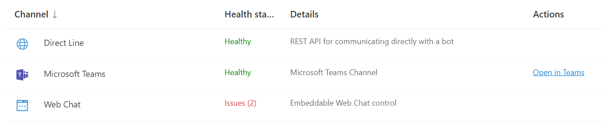
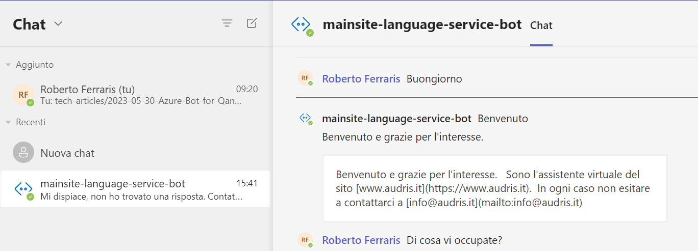
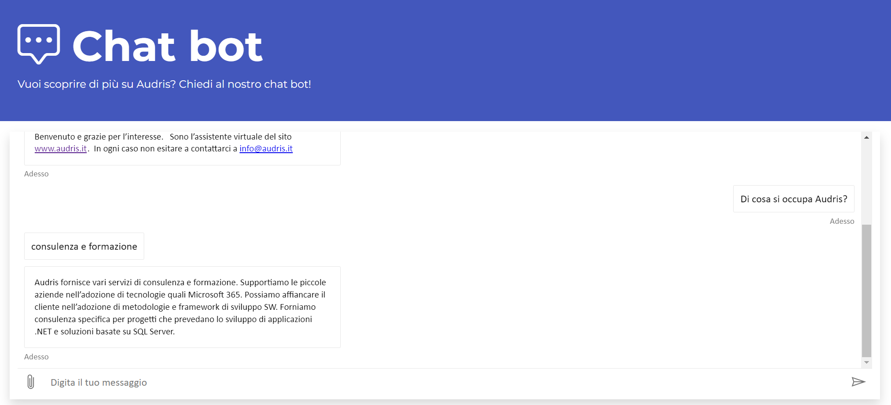
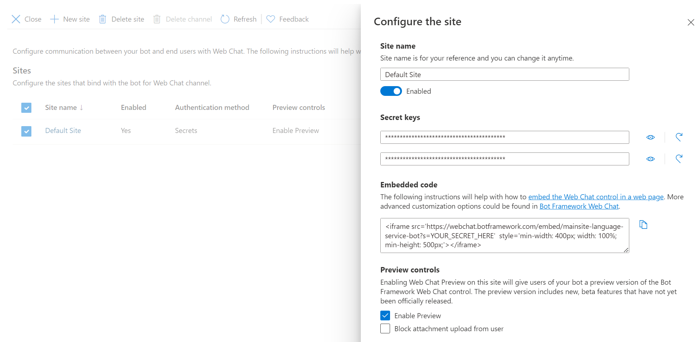

L'utilizzo di FAQ (frequently asked questions) è diffuso in vari ambiti per
fornire un primo supporto agli utenti.  
Con l'utilizzo del [servizio Azure Bot](https://azure.microsoft.com/products/bot-services/) è possibile trasformare l'esperienza utente in modo semplice e rendere queste informazioni facilmente accessibili in modo interattivo.

Il servizio di chat può essere facilmente integrato in un sito web, su Microsoft Teams o in tanti altri canali. Puoi trovare maggiori informazioni sui canali supportati [qui](https://learn.microsoft.com/azure/bot-service/bot-service-manage-channels?view=azure-bot-service-4.0).

Di seguito viene fornita una breve introduzione all'argomento e una guida
per la configurazione del servizio.

## Perchè trasformare la FAQ in un chatbot

Ci sono molti motivi per preferire l'utilizzo di una chat interattiva rispetto ad una semplice FAQ testuale.  

Tuttavia, esistono anche dei motivi per non farlo, come ad esempio il costo (seppur non elevato), ma ritengo che il principale sia legato ai contenuti.  
Se le informazioni che desideriamo fornire sono limitate
e possono essere presentate all'utente tramite una piccola pagina web, allora non è necessario trasformare la stessa in una chat.

Supponiamo invece di considerare una base di conoscenza abbastanza ampia attraverso la chat. Quali sono i motivi che potrebbero spingerci a scegliere questo tipo di strumento?

Il motivo principale dovrebbe essere quello di semplificare l'esperienza utente.
In questo senso, la chat mette a disposizione una *ricerca di tipo semantico*.
Utilizzando le funzionalità di analisi del linguaggio naturale, si consente all'utente di trovare le risposte che cerca esprimendo le richieste nel proprio linguaggio.  

Considerando una pagina di FAQ molto lunga: non tutti gli utenti conoscono le funzionalità di ricerca del browser e, anche se le conoscono, la ricerca si limita a trovare corrispondenze esatte nel testo. Pertanto, se non si conoscono i termini utilizzati nel documento, la ricerca diventa difficoltosa.

Come potenziale conseguenza, migliorando la capacità dell'utente di trovare autonomamente le informazioni necessarie, si riducono le richieste all'help desk.

Un altro motivo potrebbe essere la raccolta di dati sui tipi di domande per migliorare il servizio stesso. Con il servizio di chat, le domande possono essere registrate per identificare eventuali domande senza risposta. Ciò consente di migliorare il servizio integrando le informazioni (aggiungendo nuove informazioni o semplicemente inserendo forme alternative alle domande già disponibili).

## Come creare il bot e testarlo

La procedura dettagliata per creare un bot è descritta nel tutorial
[Build a bot with the Language Service and Azure Bot Service - MS Learn](https://learn.microsoft.com/en-us/training/modules/build-faq-chatbot-qna-maker-azure-bot-service/). Inoltre si può seguire l'esercizio collegato ad esso collegato
[Explore question answering](https://microsoftlearning.github.io/AI-900-AIFundamentals/instructions/04d-create-a-bot.html).  

Di seguito ci limiteremo quindi a vedere un elenco dei passi prinicipali (partendo dal presupposto di avere già una sottoscrizione Azure attiva) evidenziando anche alcuni aspetti da tenere in considerazione.

1) Creare un nuovo servizio [Language](https://learn.microsoft.com/en-us/azure/cognitive-services/language-service/overview).
   Questo servizio costituisce la base per la gestione del riconoscimento del testo ed è il punto di partenza per implementare soluzioni che utilizzano questa tecnologia. Il servizio unisce diverse funzionalità,
   ma per il nostro caso d'uso siamo ci interessa particolarmente la QnA (domande e risposte).
2) Utilizzare [Language Studio](https://language.cognitive.azure.com/home) per creare un *progetto* ed addestrare il sistema: Language Studio permette di crerare un progetto e fornire l'elenco delle domande e risposte della nostra FAQ per addestrare il sistema.
3) Testare il sistema utilizzando la funzionalità di Test integrata e , se necessario, integrare le domande con alternative per migliorare le capacità di riconoscimento del sistema.
4) Dopo aver validato il funzionamento del sistema, eseguire il Deploy sul servizio Language Service collegato. Questo step consisnte nel creare nel creare un modello su Azure basato sulle coppie di domande e risposte fornite.
5) A questo punto, si può creare un [Azure Bot](https://learn.microsoft.com/en-us/azure/bot-service/?view=azure-bot-service-4.0).
   Per comodità, nella pagina di deploy di Language Studio è già disponibile un link
   ad un wizard, che utilizzando un template predefinito, permette di creare il bot e l'infrastruttura correlata.

Una volta completati questi passaggi, avrai a disposizione un servizio Azure Bot da integrare nei tuoi sistemi di interesse, come ad esempio Microsoft Teams.

Da tenere in considerazione nella creazione del bot i seguenti aspetti.

- La sottoscrizione di Azure prevede la possibilità di creare un solo servizio Language Service gratuito. Se si desidera creare più di un bot, sarà necessario attivare un piano a pagamento.  
- Il bot può essere creato in diverse lingue, ma è necessario scegliere una lingua principale. Questa scelta è importante in quanto determina la lingua utilizzata per la gestione della chat.

In particolare in relazione al piano gratuito i seguenti limiti sono da tenere in considerazione:

- Limite di 10.000 transazioni al mese. Se si supera questo limite, il servizio non sarà più disponibile fino al mese successivo.
- Limite di 3.000 transazioni al minuto. Se si supera questo limite, il servizio non sarà più disponibile fino al minuto successivo.
- Limite di 1.000 transazioni al secondo. Se si supera questo limite, il servizio non sarà più disponibile fino al secondo successivo.

> Per maggiori informazioni sui piani disponibili, si può fare riferimento alla [pagina di pricing](https://azure.microsoft.com/pricing/details/cognitive-services/language-understanding-intelligent-services/).

## Ma come faccio ad aggiornare il bot? Devo mantenere una FAQ separata?

Con l'utilizzo di Azure Bot e di [Language Studio](https://language.cognitive.azure.com/home), la gestione dell'aggiornamento del bot e della base di conoscenza è molto semplice.

Puoi scegliere di utilizzare una FAQ già esistente, che può essere un documento Word, un PDF o una pagina HTML. In alternativa, puoi utilizzare direttamente Language Studio per redigere la FAQ.

Language Studio mette a disposizione diverse funzionalità specifiche per il servizio di chat che ci interessa:

- Interfaccia semplice per gestire le domande e le risposte.
- Test della chat integrata che consente di verificare immediatamente le modifiche apportate.
- Possibilità di inserire domande alternative. Questo è utile nel caso in cui una domanda venga formulata in modi diversi e il riconoscimento del linguaggio naturale non riesca a identificare una risposta già presente nella base di conoscenza.
- Addestramento semplificato e deployment verso il servizio di Azure.

> -- TODO inserire print screen di Language Studio --

## Cosa fare dopo la creazione della chat

Una volta creato il bot, ci sono diversi modi in cui puoi utilizzarlo.
Come già accennato, puoi gestire i canali attraverso cui il bot sarà accessibile utilizzando la voce di menu *Channels*.

Vediamo le caratteristiche e la configurazione di alcuni di questi canali in dettaglio.

### Integrazione in Microsoft Teams

L'integrazione in [Microsoft Teams](https://learn.microsoft.com/en-us/azure/bot-service/channel-connect-teams?view=azure-bot-service-4.0) è sicuramente una delle più interessanti.
Permette di integrare facilmente una FAQ all'interno del sistema di comunicazione aziendale senza dover installare alcuna applicazione aggiuntiva.

> Tuttavia, l'attivazione del canale su Teams richiede l'accettazione di alcune condizioni di utilizzo. In particolare, è necessario accettare che i dati vengano trasferiti al servizio di Microsoft Teams. I dettagli di tali condizioni sono riportati in [Microsoft Channel Pubblication Terms](https://www.botframework.com/content/bot-service-channels-terms.htm) e [Informativa sulla privacy](https://privacy.microsoft.com/it-it/privacystatement).

L'attivazione  del canale può essere effettuata tramite la voce *Channels* e non richiede alcuna configurazione particolare, a parte l'accettazione delle condizioni di utilizzo.

Una volta attivato il canale, puoi testare il bot all'interno di Teams selezionando  semplicemente la voce `Open in Teams` dall'elenco dei canali, come mostrato nell'immagine seguente:



A seguito di ciò, verrà creato un nuovo canale di chat in Teams, dove potrai iniziare a interagire con il bot stesso.



Dopo aver verificato il funzionamento, puoi distribuire il bot all'interno di Teams come un'app. Le modalità per distribuire l'app sono disponibili nella sezione [Publish your bot to Teams](https://docs.microsoft.com/en-us/azure/bot-service/channel-connect-teams?view=azure-bot-service-4.0#publish-your-bot-to-teams).

### Integrazione in una pagina HTML

Un'altra possibilità è quella di integrare il bot in una pagina HTML.
Per fare ciò, è necessario attivare il canale *Web Chat* e configurarlo. La procedura di dettaglio è descritta in [Connect a bot to Web Chat](https://learn.microsoft.com/azure/bot-service/bot-service-channel-connect-webchat?view=azure-bot-service-4.0#get-your-bot-secret-key).

Di seguito un esempio di integrazione in una pagina HTML.



#### Chiavi per l'integrazione in una pagina HTML

Una volta attivato il canale Web Chat, è necessario aggiungere un *sito*. È infatti a livello di sito che vengono fornite le chiavi per accedere alla chat.

Per ogni sito vengono generate delle chiavi che consentono l'accesso alla chat. Queste chiavi vengono utilizzate per configurare la chat all'interno della pagina HTML. In particolare l'integrazione nella pagina HTML può avvenire attraverso l'inserimento di un tag `<iframe>`, il quale viene proposto direttamente nella pagina di configurazione di Azure.



Non è consigliato inserire il secret direttamente nel codice HTML, nonostante il template per il tag `<iframe>` lo suggerisca. Questo approccio esporrebbe le chiavi in chiaro a chiunque accede alla pagina HTML, permettendo a chiunque di utilizzare il bot nel proprio sito (una situazione che generalmente non è desiderabile).

Per ovviare a questo problema, è possibile utilizzare un approccio che prevede l'utilizzo di un server per la gestione di chiavi *temporanee*. É infatti possibile ottnere un token provvisorio dall'endpoint `https://webchat.botframework.com/api/tokens`, utilizzando le chiavi di accesso al sito. Il token ottenuto può essere utilizzato nel tag iFrame in alternativa al secret, semplicemente sostituendo `?s=<secret>` con `?t=<token>`.

> IMPORTANTE: in questa soluzione, il token è comunque esposto pubblicamente, ma la sua durata limitata nel tempo e la possibilità di rigenerarlo periodicamente rendono questo approccio più sicuro rispetto all'utilizzo del secret. Per ulteriori dettagli, consulta la [documentazione ufficiale](https://learn.microsoft.com/azure/bot-service/bot-service-channel-connect-webchat?view=azure-bot-service-4.0).  

Di seguito è riportato un esempio di codice che può essere utilizzato in ASP.NET per recuperare il token e impostare l'attributo `src` del tag `<iFrame>`.

```csharp
using (var requestMessage = 
      new HttpRequestMessage(HttpMethod.Get, "https://webchat.botframework.com/api/tokens")) { 
      requestMessage.Headers.Authorization = 
         new AuthenticationHeaderValue("BotConnector", mySecret);
      var result = await HttpClient.SendAsync(requestMessage);
      var webChatToken = (await result.Content.ReadAsStringAsync())
         // la response con il token contiene le virgolette all'inizio e alla fine
         .Trim('"'); 
      ChatUrl = $"{WebChatConfig.ChatUrl}?t={webChatToken}";
}
```

## Personalizzazione

### Messaggio di benvenuto

Se avete impostato la lingua in italiano è opportuno fare in modo che anche il messaggio iniziale sia in italiano.  
Di default infatti il bot inizia la conversazione (almeno sui canali web) con la frase "Hello and Welcome!".

La personalizzazione di questa frase non è immediata. Infatti occorre andare a configurare l'*App Service* associato
al bot. Nel caso specifico occorre aggiungere l'impostazione `DefaultWelcomeMessage` nella sezione *Configuration > Application Settings".

-- TODO verificare come personalizzare il nome del bot in Teams


## Azure Bot non serve solo a questo ...

Quanto presentato nell'articolo è solo una delle tante possibilità di utilizzo del servizio.

Esistono molte altre possibilità per sfruttare questa tecnologia, e sicuramente una tra le più
interessanti è quella di integrare il bot in una applicazione per far interagire
gli utenti con l'applicazione stessa.

Altra possibilità è quella di creare dei classificatori di testo automatici ecc.

> -- TODO Chiedere revisione a Luca e Margherita --  
> -- TODO Inserire chi siamo di Audris e riferimento --  
> -- TODO Preparare testo per post da inserire in linked in e su sito Audris --
